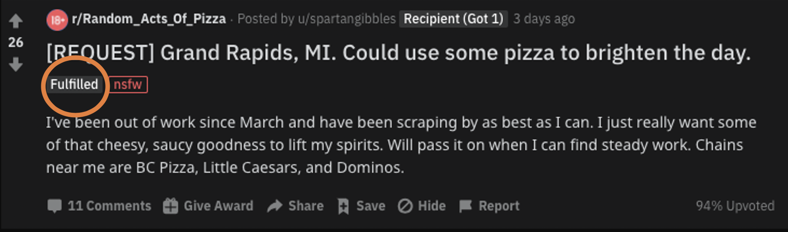

# Predicting Altruism Through Free Pizza with NLP and Classification - Metis Project 4
Rudy Wang

## Background

[R/random_acts_of_pizza](https://www.reddit.com/r/Random_Acts_Of_Pizza/)(RAOP) is a subreddit on Reddit.com that allows users to request free pizza from other users. The subreddit has strict rules and moderators/bots that keep track of each successful transaction that was successfully made on each post. 

But what makes some submissions receive free pizza? And what makes others not receive pizza? 

In the example post above, if a submission was successful in receiving a pizza, a flair would show up as "Fulfilled". If a submission was not successful in receiving a pizza, there would be no indication of a flair. 

## Mission

Using NLP, I wanted to explore the potential different topics that may emerge between receiving vs not receiving pizza submissions. Furthermore, I would like to include the topics we derived from the training dataset to be applied on the testing dataset to see if we would be successful in classifying submissions correctly.

## Process

1. Used [PushShiftData API](https://github.com/pushshift/api) to grab the Submission IDs, Request Title, and Request Text (Body) of submissions from January 1, 2014 - August 13, 2020. Extracted out 58,541 extra submissions. 
2. Using [PRAW API](https://praw.readthedocs.io/en/latest/), find the most updated flairs by searching with the Submission IDs extracted from PushShiftData API. Cleaned up the dataframe by removing deleted posts, and flairs that were not designated as either being empty or 'Fulfilled'. 
3. Combined the extracted dataset with the Kaggle dataset and split into training and testing: Training with 30,420 entries and Testing with 8,227 entries. 
4. 
