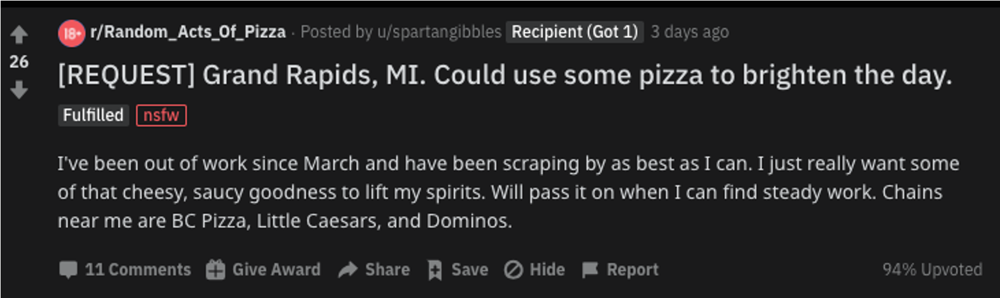

# Predicting Altruism Through Free Pizza with NLP - Metis Project 4
Rudy Wang

# Background

[R/random_acts_of_pizza](https://www.reddit.com/r/Random_Acts_Of_Pizza/)(RAOP) is a subreddit on Reddit.com that allows users to request free pizza from other users. The subreddit has strict rules and moderators/bots that keep track of each transaction that was successfully made on each post. 

But what makes some submissions receive free pizza? And what makes others not receive pizza? 

In the example post above, 
